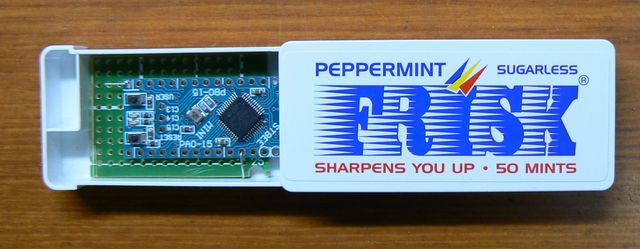
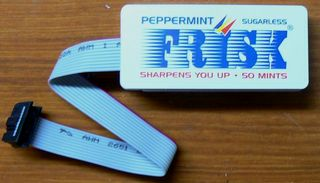
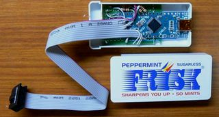

Armblaster, yet another STM32 jtag cable
========================================

Pictures
========

Compilation
===========

If you have docker, you can run `./build.sh`, which will build the firmware in the `binaries/` directory.

Hardware
========

Only one board for now:

* STBee mini

Software
========

* OpenOCD support

Todo
====

* flashing instructions
* bluepill support

Links
=====

* Mirrored from: http://hp.vector.co.jp/authors/VA000177/html/arm_blaster.html
* Buy an STBee from StrawberryLinux: https://strawberry-linux.com/catalog/items?code=32105
* Mirror by Iruka: https://github.com/iruka-/ATMEL_AVR/blob/master/md/arm_blaster.md
